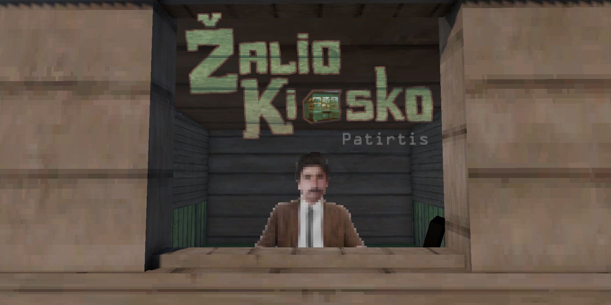

  

# Žalio Kiosko Patirtis (Green Kiosk Experience)

## Description

[Global Game Jam 2025](https://globalgamejam.org/) game entry, where the theme was "Bubbles".

### LT

2008 m., Alytus. Jūs kaip Žalio kiosko pardavėjas dirbate Putinų mikrorajone. Ekonominei krizei rodant nagus kyla įtampa tarp kiosko klientų. Kiekvienas pardavimas sudėtingas – pirkėjai turi daug norų, bet juos suprasti sunku, o ne taip supratus galima gauti į snukį ir bankrutuoti. Visas darbas dėl svarbaus tikslo - uždirbti litų ir išvykti į Jamaiką.

Skūpus du rozu moka, tinginys du rozu eina!

### EN

2008, Alytus. You work as a green kiosk vendor in the Putinai district. As the economic crisis shows its claws, tensions arise among the kiosk's customers. Every sale is difficult - customers have many desires, but it's hard to understand them, and if you make a wrong sell, you can get punched in the nose and go bankrupt. All this work for an important goal - to earn litas and go to Jamaica.

A scrooge pays twice, a lazy man goes twice!

## Credits

- [Edvinas Danevičius](https://github.com/Edvinas01)
- [Dovydas Reitelaitis](https://www.instagram.com/reitelaitis/)
- [Rokas Sutkus](https://www.instagram.com/sutkusaudio/)
- [Teresė Žvinakevičiūtė](https://www.instagram.com/teresesutkus/)

## Links

- [Download latest release (Windows)](https://github.com/Edvinas01/ggj-2025/releases/latest)
- [Download from itch.io (Windows)](https://uab-petelnia.itch.io/zalio-kiosko-patirtis)
- [Global Game Jam 2025 Page](https://globalgamejam.org/games/2025/green-kiosk-experience-zalio-kiosko-patirtis-0)
- [Watch Trailer On YouTube](https://www.youtube.com/watch?v=9QybWqN1ttU)

## Development

- [Unity 6000.0.34f1](https://unity.com/download#how-get-started)
- [FMOD Studio 2.02.11](https://www.fmod.com/download) (optional)
